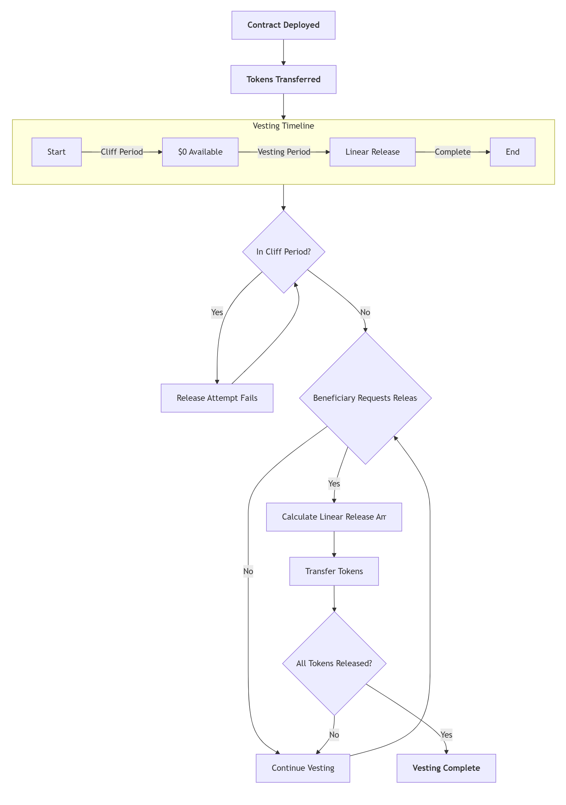

*The diagram above illustrates how tokens are locked during the cliff period and then released linearly over the vesting period. Only the beneficiary can release vested tokens at any time after the cliff ends.*

Part 1: Deployment and Funding

Start with a rectangle: "Contract Deployed"

Then an arrow down to the next rectangle: "Tokens Transferred to Vesting Contract"

Part 2: Timeline

We can create a horizontal timeline below the funding step.

The timeline has four phases: Start, Cliff Period, Vesting Period, End.

We can use a horizontal line and place labels above or below the line for each phase.

Part 3: Token Release

From the timeline, we can have a vertical arrow pointing to a decision diamond: "Cliff Over?"

If no (during cliff): point to a note: "$0 tokens available" and then loop back to the timeline until cliff is over.

If yes (after cliff): then we go to a process of linear release.

Part 4: Linear Release and Claim

After cliff, we have a period of linear release. We can represent this as a bar that grows over time.

Then, the beneficiary can release at any time after cliff. So we can have a step: "Beneficiary Can Release Tokens" which leads to "Tokens Claimed".

However, note that the release can happen multiple times during the vesting period. So we might want to show a loop.

Alternatively, we can simplify the diagram to be linear and use notes for the conditions.

---------------------------------------------------------------------------

DIAGRAM VESTING-WORKFLOW.png:

    flowchart TD
    %% Deployment Phase
    A[**Contract Deployed**] --> B[**Tokens Transferred**]
    
    %% Timeline Phase
    B --> Timeline
    
    subgraph Timeline[Vesting Timeline]
        direction LR
        T1[Start] -->|Cliff Period| T2[$0 Available]
        T2 -->|Vesting Period| T3[Linear Release]
        T3 -->|Complete| T4[End]
    end
    
    %% Cliff Logic
    Timeline --> C{In Cliff Period?}
    C -->|Yes| D[Release Attempt Fails]
    D --> C
    
    C -->|No| E{Beneficiary Requests Release?}
    
    E -->|No| F[Continue Vesting]
    F --> E
    
    E -->|Yes| G[Calculate Linear Release Amount]
    G --> H[Transfer Tokens]
    
    H --> I{All Tokens Released?}
    I -->|No| F
    I -->|Yes| J[**Vesting Complete**]

DIAGRAM VESTING-WORKFLOW.png2:

flowchart TD
    A[Contract Deployed Basic: Rectangle] --> B[Tokens Transferred to Contract Basic: Rectangle]
    B --> C[Vesting Timeline Starts Basic: Rectangle]
    C --> D{Cliff Period? Flowchart: Diamond}
    
    D -- No Basic: Arrow --> E[Vesting Period Active Basic: Rectangle]
    D -- Yes Basic: Arrow --> F[$0 Tokens Available Basic: Rectangle]
    
    F --> G{Cliff Ended? Flowchart: Diamond}
    G -- No Basic: Arrow --> F
    G -- Yes Basic: Arrow --> E
    
    E --> H{Beneficiary Initiates Release? Flowchart: Diamond}
    H -- No Basic: Arrow --> I[Continue Vesting Basic: Rectangle]
    H -- Yes Basic: Arrow --> J[Calculate Available Tokens Basic: Rectangle]
    
    J --> K[Transfer Tokens to Beneficiary Basic: Rectangle]
    K --> L{More Tokens to Vest? Flowchart: Diamond}
    
    L -- Yes Basic: Arrow --> I
    L -- No Basic: Arrow --> M[All Tokens Vested Basic: Rectangle]
    
    I --> H

